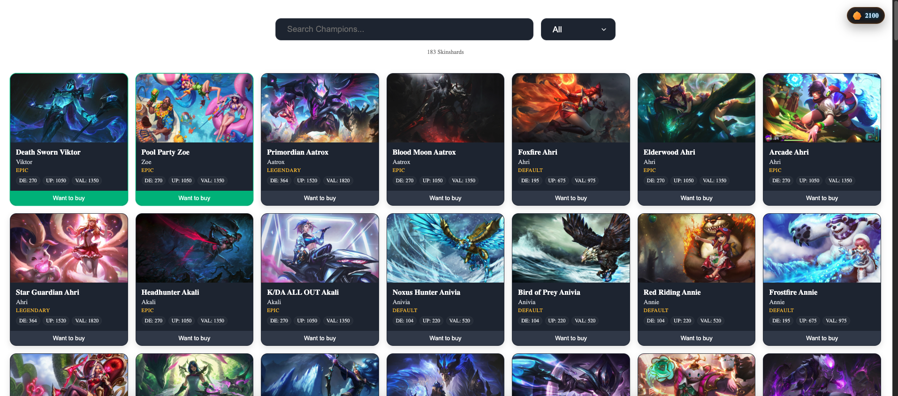
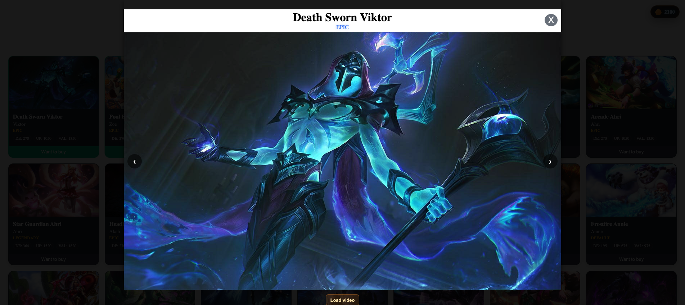

# Lolskinshards Frontend


A **small proof of concept** to display, filter, and search **League of Legends skin shards** more efficiently.  
The official client UI is too minimal once you have 100+ shards and want to decide which to **buy** or **reroll**.

This app uses the **local League Client API** that the LoL client itself communicates with.

> Backend currently retrieves credentials **only on macOS**.

---

## Preview





## Notes

- **No code style**
- **No separation of concerns**
- **No tests**
- **Not production-ready**

---

## Reference

Based on info from  
[reganchan.ca – Efficient Hextech Crafting](https://reganchan.ca/blog/efficient-hextech-crafting)


## Development server

To start a local development server, run:

```bash
ng serve
```

Once the server is running, open your browser and navigate to `http://localhost:4200/`. The application will automatically reload whenever you modify any of the source files.
